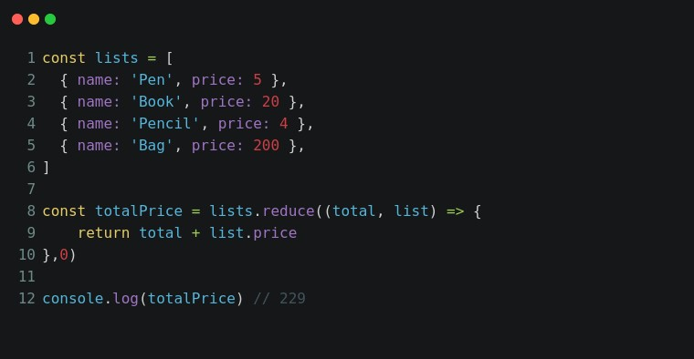

# Array Manipulation


# ForEach

#### Use `every()` instead of `forEach()`

The [`every()` function](https://developer.mozilla.org/en-US/docs/Web/JavaScript/Reference/Global_Objects/Array/every) behaves exactly like `forEach()`, except it stops iterating through the array whenever the callback function returns a [falsy value](https://masteringjs.io/tutorials/fundamentals/falsy).

```javascript
// Prints "1, 2, 3"
[1, 2, 3, 4, 5].every(v => {
  if (v > 3) {
    return false;
  }

  console.log(v);
  // Make sure you return true. If you don't return a value, `every()` will stop.
  return true;
});
```


#### Exemplo

```javascript
employees.forEach((employee) => related.push(`${employee.firstName} ${employee.lastName}`));
```


# Map


#### Exemple

```javascript

```

# Reduce



Let's say you have an array like this:  

```javascript
[
    {id: 1, category: "frontend", title: "All About That Sass"},
    {id: 2, category: "backend", title: "Beam me up, Scotty: Apache Beam tips"},
    {id: 3, category: "frontend", title: "Sanitizing HTML: Going antibactirial on XSS attacks"}
]
```

And you'd like to get an object with categories as keys, mapping to the article id's with that category, like this:  

```javascript
{
    frontend: [1, 3],
    backend: [2]
}
```

You can use our friend [`Array.prototype.reduce`](https://developer.mozilla.org/en-US/docs/Web/JavaScript/Reference/Global_Objects/Array/Reduce) for this.  

```javascript
const posts = [
    {id: 1, category: "frontend", title: "All About That Sass"},
    {id: 2, category: "backend", title: "Beam me up, Scotty: Apache Beam tips"},
    {id: 3, category: "frontend", title: "Sanitizing HTML: Going antibactirial on XSS attacks"}
];

const categoryPosts = posts.reduce((acc, post) => {
    let {id, category} = post;
    return {...acc, [category]: [...(acc[category] || []), id]};
}, {});
```


### Exemplo 1

```javascript
const data = require('../data/zoo_data');

function isManager(id) {

	return data.employees.some((employee) => employee.managers.includes(id));

}

function getRelatedEmployees(managerId) {

if (!isManager(managerId)) {

	throw new Error('O id inserido não é de uma pessoa colaboradora gerente!');

}

const employees = data.employees.filter((employee) => employee.managers.includes(managerId));

const related = [];

employees.forEach((employee) => related.push(`${employee.firstName} ${employee.lastName}`));

return related;

}

module.exports = { isManager, getRelatedEmployees };
```


  


