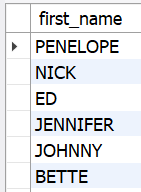
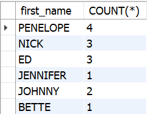
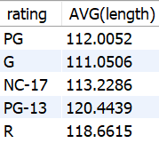
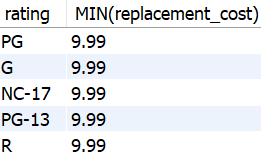
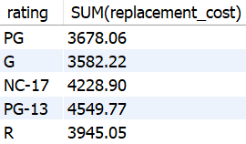

# MySQL

## Manipulação de strings

```sql
-- Converte o texto da string para CAIXA ALTA
SELECT UCASE('Oi, eu sou uma string');

-- Converte o texto da string para caixa baixa
SELECT LCASE('Oi, eu sou uma string');
-- Substitui as ocorrências de uma substring em uma string
SELECT REPLACE('Oi, eu sou uma string', 'string', 'cadeia de caracteres');
-- Retorna a parte da esquerda de uma string de acordo com o
-- número de caracteres especificado
 SELECT LEFT('Oi, eu sou uma string', 3);

-- Retorna a parte da direita de uma string de acordo com o
-- número de caracteres especificado
 SELECT RIGHT('Oi, eu sou uma string', 6);

-- Exibe o tamanho, em caracteres, da string, a função LENGTH retorna o tamanho em bytes
 SELECT CHAR_LENGTH('Oi, eu sou uma string');

-- Extrai parte de uma string de acordo com o índice de um caractere inicial
-- e a quantidade de caracteres a extrair
 SELECT SUBSTRING('Oi, eu sou uma string', 5, 2);

-- Se a quantidade de caracteres a extrair não for definida,
-- então a string será extraída do índice inicial definido, até o seu final
 SELECT SUBSTRING('Oi, eu sou uma string', 5);
```


#### Exemplos

```sql
SELECT UCASE(title) FROM sakila.film LIMIT 10;
SELECT LCASE(title) FROM sakila.film LIMIT 10;
SELECT REPLACE(title, 'ACADEMY', 'FOO') FROM sakila.film WHERE film_id = 1;
SELECT LEFT(title, 7) FROM sakila.film WHERE film_id = 1;
SELECT RIGHT(title, 8) FROM sakila.film WHERE film_id = 1;
SELECT CHAR_LENGTH(title) FROM sakila.film WHERE film_id = 1;
SELECT SUBSTRING(title, 5, 2) FROM sakila.film WHERE film_id = 1;
SELECT SUBSTRING(title, 5) FROM sakila.film WHERE film_id = 1;
```


## Condicionais

#### IF

```sql
-- Sintaxe:
SELECT IF(condicao, valor_se_verdadeiro, valor_se_falso);

SELECT IF(idade >= 18, 'Maior de idade', 'Menor de Idade')
FROM pessoas;

SELECT IF(aberto, 'Entrada permitida', 'Entrada não permitida')
FROM estabelecimentos;

-- Exemplo utilizando o banco sakila:
SELECT first_name, IF(active, 'Cliente Ativo', 'Cliente Inativo') AS status
FROM sakila.customer
LIMIT 20;
```


#### CASE

```sql
-- Sintaxe:
SELECT CASE
  WHEN condicao THEN valor
  ELSE valor padrao
END;

SELECT
    nome,
    nivel_acesso,
    CASE
        WHEN nivel_acesso = 1 THEN 'Nível de acesso 1'
        WHEN nivel_acesso = 2 THEN 'Nível de acesso 2'
        WHEN nivel_acesso = 3 THEN 'Nível de acesso 3'
        ELSE 'Usuário sem acesso'
    END AS nivel_acesso
FROM permissoes_usuario;

-- Exemplo utilizando a tabela sakila.film:
SELECT
    first_name,
    email,
    CASE
        WHEN email = 'MARY.SMITH@sakilacustomer.org' THEN 'Cliente de baixo valor'
        WHEN email = 'PATRICIA.JOHNSON@sakilacustomer.org' THEN 'Cliente de médio valor'
        WHEN email = 'LINDA.WILLIAMS@sakilacustomer.org' THEN 'Cliente de alto valor'
        ELSE 'não classificado'
    END AS valor
FROM sakila.customer
LIMIT 10;
```


## Funções matemáticas do MySQL

#### Adição, subtração, multiplicação e divisão

```sql
SELECT 5 + 5;
SELECT 5 - 5;
SELECT 5 * 5;
SELECT 5 / 5;
```


##### Exemplos

```sql
SELECT rental_duration + rental_rate FROM sakila.film LIMIT 10;
SELECT rental_duration - rental_rate FROM sakila.film LIMIT 10;
SELECT rental_duration / rental_rate FROM sakila.film LIMIT 10;
SELECT rental_duration * rental_rate FROM sakila.film LIMIT 10;
```


### Divisão de inteiros com `DIV` e como encontrar seus restos com o `MOD`

```sql
SELECT 10 DIV 3; -- 3
SELECT 10 DIV 2; -- 5
SELECT 14 DIV 3; -- 4
SELECT 13 DIV 2; -- 6
```

#### MOD
```sql
SELECT 10 MOD 3; -- 1
SELECT 10 MOD 2; -- 0
SELECT 14 MOD 3; -- 2
SELECT 13 MOD 2; -- 1
SELECT 10.5 MOD 2; -- 0.5, ou seja, 2 + 2 + 2 + 2 + 2 = 10, restando 0.5
```


### Arredondando valores

```sql
-- Podemos omitir ou especificar quantas casas decimais queremos
SELECT ROUND(10.4925); -- 10
SELECT ROUND(10.5136); -- 11
SELECT ROUND(-10.5136); -- -11
SELECT ROUND(10.4925, 2); -- 10.49
SELECT ROUND(10.4925, 3); -- 10.493
```


#### O arredondamento **sempre** para cima pode ser feito com o `CEIL`:

```sql
SELECT CEIL(10.51); -- 11
SELECT CEIL(10.49); -- 11
SELECT CEIL(10.2); -- 11
```


#### O arredondamento **sempre** para baixo pode ser feito com o `FLOOR`:

```sql
SELECT FLOOR(10.51); -- 10
SELECT FLOOR(10.49); -- 10
SELECT FLOOR(10.2); -- 10
```


### Exponenciação e raiz quadrada

```sql
SELECT POW(2, 2); -- 4
SELECT POW(2, 4); -- 16
```

```sql
SELECT SQRT(9); -- 3
SELECT SQRT(16); -- 4
```


### Gerando valores aleatórios

```sql
-- Para gerar um valor aleatório entre 0 e 1:
SELECT RAND();

-- Para gerar um valor entre 7 e 13:
SELECT ROUND(7 + (RAND() * 6));

-- O cálculo que é feito é o seguinte: (7 + (0.0 a 1.0 * 6))
```


## Trabalhando com datas

```sql
SELECT CURRENT_DATE(); -- YYYY-MM-DD
SELECT NOW(); -- YYYY-MM-DD HH:MM:SS
```

Também podemos calcular a diferença em dias entre duas datas usando o `DATEDIFF` e a diferença de tempo entre dois horários usando o `TIMEDIFF`. Em ambos os casos, o segundo valor é subtraído do primeiro para calcular o resultado.

```sql
-- 30, ou seja, a primeira data é 30 dias depois da segunda
SELECT DATEDIFF('2020-01-31', '2020-01-01');

-- -30, ou seja, a primeira data é 30 dias antes da segunda
SELECT DATEDIFF('2020-01-01', '2020-01-31');

-- -01:00:00, ou seja, há 1 hora de diferença entre os horários
SELECT TIMEDIFF('08:30:10', '09:30:10');

-- -239:00:00, ou seja, há uma diferença de 239 horas entre as datas
SELECT TIMEDIFF('2021-08-11 08:30:10', '2021-08-01 09:30:10');
```

Outro ponto interessante é que também podemos usar `CURRENT_DATE()` e `NOW()` em conjunto com os comandos de manipulação de datas e tempo para encontrar resultados dinâmicos da seguinte maneira:

```sql
SELECT YEAR(CURRENT_DATE()); -- retorna o ano atual
2SELECT HOUR(NOW()); -- retorna a hora atual
```

## Utilizando as funções de agregação `AVG`, `MIN`, `MAX`, `SUM` e `COUNT`

```sql
-- Usando a coluna replacement_cost (valor de substituição), vamos encontrar:
SELECT AVG(replacement_cost) FROM sakila.film; -- 19.984000 (Média entre todos registros)
SELECT MIN(replacement_cost) FROM sakila.film; -- 9.99 (Menor valor encontrado)
SELECT MAX(replacement_cost) FROM sakila.film; -- 29.99 (Maior valor encontrado)
SELECT SUM(replacement_cost) FROM sakila.film; -- 19984.00 (Soma de todos registros)
SELECT COUNT(replacement_cost) FROM sakila.film; -- 1000 registros encontrados (Quantidade)
```


## Exibindo e filtrando dados de forma agrupada com `GROUP BY` e `HAVING`

```sql
SELECT coluna(s) FROM tabela
GROUP BY coluna(s);
```

```sql
SELECT first_name FROM sakila.actor
GROUP BY first_name;
```



```sql
SELECT first_name, COUNT(*) FROM sakila.actor
GROUP BY first_name;
```



```sql
-- Média de duração de filmes agrupados por classificação indicativa
SELECT rating, AVG(length)
FROM sakila.film
GROUP BY rating;

-- Valor mínimo de substituição dos filmes agrupados por classificação indicativa
SELECT rating, MIN(replacement_cost)
FROM sakila.film
GROUP BY rating;

-- Valor máximo de substituição dos filmes agrupados por classificação indicativa
SELECT rating, MAX(replacement_cost)
FROM sakila.film
GROUP BY rating;

-- Custo total de substituição de filmes agrupados por classificação indicativa
SELECT rating, SUM(replacement_cost)
FROM sakila.film
GROUP by rating;
```



Média de duração dos filmes por classificação indicativa



Valores mínimos de substituição dos filmes por classificação indicativa


Valores máximos de substituição dos filmes por classificação indicativa



Soma total do custo de substituição dos filmes por classificação indicativa


### Filtrando Resultados do `GROUP BY` com `HAVING`

```sql
SELECT first_name, COUNT(*)
FROM sakila.actor
GROUP BY first_name
HAVING COUNT(*) > 2;

-- Ou, melhor ainda, usando o AS para dar nomes às colunas de agregação,
-- melhorando a leitura do resultado
SELECT first_name, COUNT(*) AS nomes_cadastrados
FROM sakila.actor
GROUP BY first_name
HAVING nomes_cadastrados > 2;

-- Observação: o alias não funciona com strings para o HAVING,
-- então use o underline ("_") para separar palavras
-- Ou seja, o exemplo abaixo não vai funcionar
SELECT first_name, COUNT(*) AS 'nomes cadastrados'
FROM sakila.actor
GROUP BY first_name
HAVING 'nomes cadastrados' > 2;
```


## Como utilizar o `LEFT JOIN` e o `RIGHT JOIN`
