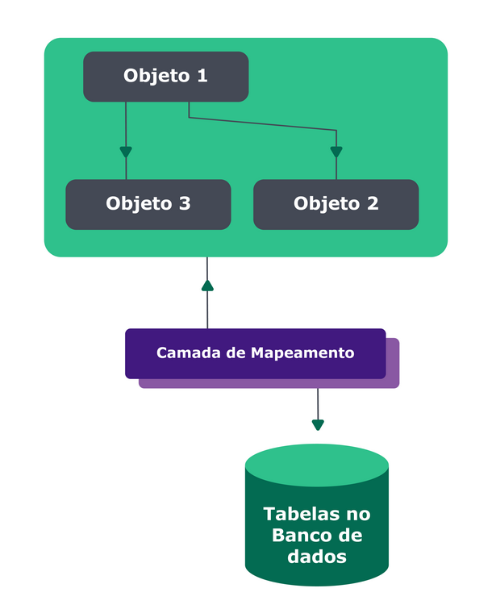
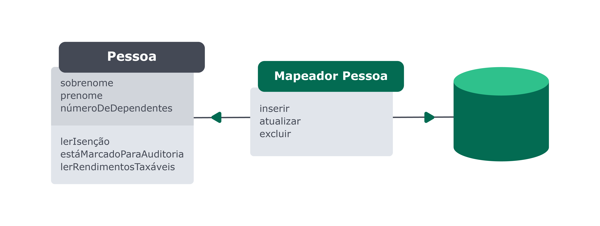

# ORM
## O que é ORM

Mapeamento objeto-relacional ou **ORM** (`Object-Relational Mapping`) é uma técnica que permite fazer um mapeamento estrutural entre as entidades do banco de dados e os objetos que as representam no código JavaScript. O mapeamento objeto-relacional abstrai as diferenças entre os dois paradigmas, da aplicação e do banco de dados, como podemos ver na imagem a seguir:

## Data Mapper

Nesse padrão, a classe que representa a tabela do banco de dados deve conhecer os recursos necessários para realizar as transações com o banco de dados, mas a classe que representa cada registro na tabela não deve saber nada do banco.

💪**Vamos trazer isso pra prática!**

Vamos usar novamente o exemplo da aplicação que gerencia clientes:

## [Sequelize](./Sequelize.md)

