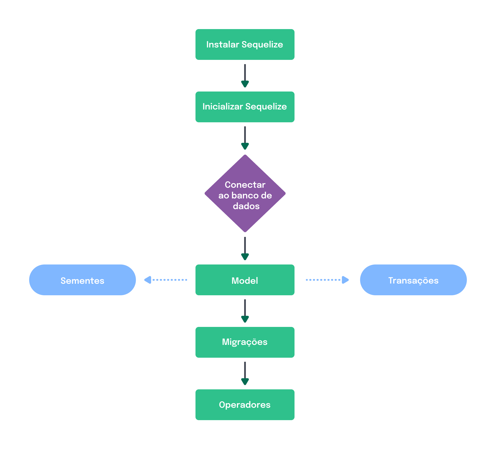

# Sequelize

Uma das bibliotecas de [ORM](./ORM.md) mais conhecidas é o Sequelize. Essa será a biblioteca usada para aprendermos [ORM](./ORM.md). Já para `banco de dados` vamos utilizar o `MySQL`.

Vale ressaltar que a maioria dos métodos fornecidos pelo Sequelize são assíncronos, portanto retornam _promises_. Dito isso, podemos usar **then**, **catch** etc. para tratar os retornos, ou podemos utilizar **async** e **await**.

💪**Vamos trazer isso pra prática!**

O fluxograma a seguir mostra as etapas para a implementação do Sequelize no seu projeto.



## Configurando o Sequelize

1️⃣ **Instalação do Sequelize**

➡️ Para começar a usar o Sequelize, é preciso iniciar uma aplicação `Node.js` e instalar essa biblioteca ORM utilizando os seguintes comandos:

```bash
mkdir app-with-sequelize && cd app-with-sequelize

npm init -y

npm install sequelize
```

```bash
npm install sequelize-cli

npm install mysql2

mkdir src
```

2️⃣ **Inicialização do Sequelize**

➡️ Depois que instalamos o `CLI`, precisamos iniciar um projeto com o Sequelize. Para isso, vamos executar o seguinte comando dentro da pasta `src`:

```bash
cd src

npx sequelize-cli init
```

Esse comando vai criar as seguintes pastas:

-   **`config`**: contém um arquivo de configuração, com orientações para o `CLI` se conectar com o nosso banco de dados;
    
-   **`models`**: contém todos os modelos da nossa aplicação;
    
-   **`migrations`**: contém todos os arquivos de migração da nossa aplicação;
    
-   **`seeders`**: contém todos os arquivos de “seeds” (sementes que são usadas para popular o banco).

3️⃣ **Conexão com o banco de dados**

➡️ Agora precisamos configurar o arquivo `config.json` gerado pelo `init` do CLI. Ao alterar esse arquivo, estamos configurando o acesso da aplicação ao nosso banco de dados.

➡️ Note que no nosso arquivo `config.json`, dentro da pasta `config`, as informações sensíveis, como credenciais de acesso ao banco de dados, estão todas expostas no nosso código. Uma boa prática é usar variáveis de ambiente para controlar o que estiver relacionado à configuração geral da aplicação. Então, bora fazer isso do jeito certo!

➡️ Vamos fazer a instalação do pacote `dotenv`:

```bash
npm install dotenv
```

➡️ Mudaremos o nome do nosso arquivo `config.json` para `config.js`

➡️ Retiraremos todo o conteúdo de `config.js` e substituíremos pelo código abaixo:

> src/config/config.js

```js
// src/config/config.js

require('dotenv').config();

const config = {
  username: process.env.MYSQL_USER,
  password: process.env.MYSQL_PASSWORD,
  database: process.env.MYSQL_DATABASE,
  host: process.env.MYSQL_HOST,
  dialect: 'mysql',
};

module.exports = {
  development: config,
  test: config,
  production: config,
};
```

➡️ Crie o arquivo `.env` **na raiz do projeto** e preencha as variáveis com as suas credenciais para acessar o MySQL:

```bash
MYSQL_USER=root
MYSQL_PASSWORD=senha_mysql
MYSQL_DATABASE=orm_example
MYSQL_HOST=localhost
```

➡️ Modifique a linha 8 do arquivo `src/models/index.js` para apontar para o arquivo `config.js`:

```js
const config = require(__dirname + '/../config/config.json')[env]; // configuração antiga
const config = require(__dirname + '/../config/config.js')[env];   // configuração nova
```

4️⃣ **O arquivo `.sequelizerc`**

➡️ Para configurar este arquivo, crie um arquivo com o nome `.sequelizerc` na raiz da aplicação com o seguinte conteúdo:

```js
const path = require('path');

module.exports = {
  'config': path.resolve('src', 'config', 'config.js'),
  'models-path': path.resolve('src', 'models'),
  'seeders-path': path.resolve('src', 'seeders'),
  'migrations-path': path.resolve('src', 'migrations'),
};
```

5️⃣ **Criação do banco de dados usando o `CLI` do Sequelize**

➡️ Agora que iniciamos uma aplicação do Sequelize, podemos criar o banco de dados `orm_example` (que nomeamos no .env) através deste comando:

```bash
npx sequelize db:create
```

### Model

Crie um arquivo `user.model.js` na pasta model com o seguinte conteúdo:

```bash
npx sequelize-cli model:generate --name UserModel 
```

```js
// src/models/user.model.js

const UserModel = (sequelize, DataTypes) => {
  const User = sequelize.define('User', {
    fullName: DataTypes.STRING,
    email: DataTypes.STRING,
  });

  return User;
};

module.exports = UserModel;
```

➡️ Agora vamos gerar um novo arquivo, com apenas o “esqueleto” de uma migration, usando o seguinte comando no terminal:

```bash
npx sequelize migration:generate --name create-user
```

➡️ Agora vamos adicionar todos os campos da nossa tabela e suas determinadas condições:

```js
src/migrations/[timestamp]-create-user.js

'use strict';

module.exports = {
	up: async (queryInterface, Sequelize) => {
	  await queryInterface.createTable('Users', {
			id: {
			 allowNull: false,
			 autoIncrement: true,
			 primaryKey: true,
			 type: Sequelize.INTEGER
			},
			fullName: {
			 type: Sequelize.STRING
			},
			email: {
			 type: Sequelize.STRING
			},
			createdAt: {
			 allowNull: false,
			 type: Sequelize.DATE
			},
			updatedAt: {
			 allowNull: false,
			 type: Sequelize.DATE
			}
		});
	},

	down: async (queryInterface, Sequelize) => {
		await queryInterface.dropTable('Users');
	}
};
```

➡️ Com a _migration_ criada, basta executarmos o seguinte comando pelo _CLI_:

```bash
npx sequelize db:migrate
```

➡️ Caso queira reverter uma _migration_ use o seguinte comando:

```bash
npx sequelize db:migrate:undo
```

## Criando uma nova migration para alterar uma tabela **já existente**

➡️ Para criar uma outra migration para adicionar a coluna `phoneNum` na sua tabela `Users`, você deve criar um novo arquivo com o seguinte comando:

```bash
npx sequelize migration:generate --name add-column-phone-table-users
```

```js
// src/migrations/[timestamp]-add-column-phone-table-users.js

'use strict';

module.exports = {
  up: async (queryInterface, Sequelize) => {
   await queryInterface.addColumn('Users', 'phoneNum', {
     type: Sequelize.STRING,
   });
  },

  down: async (queryInterface, Sequelize) => {
    await queryInterface.removeColumn('Users', 'phoneNum');
  }
};
```

➡️ Em seguida rodamos o comando abaixo para executar a nossa nova _migration_:

```bash
npx sequelize db:migrate
```

➡️ Também devemos alterar o model `user.model.js` para incluir a nova coluna `phoneNum` da seguinte forma:

```js
// src/models/user.model.js

// const User = (sequelize, DataTypes) => {
//   const User = sequelize.define('User', {
//     fullName: DataTypes.STRING,
//     email: DataTypes.STRING,
       // aqui inserimos o datatype da coluna criada
       phoneNum: DataTypes.STRING,
//   });
// 
//   return User;
// };

// module.exports = User;
```

## [Sequelize checklist](./Sequelize-checklist.md)


